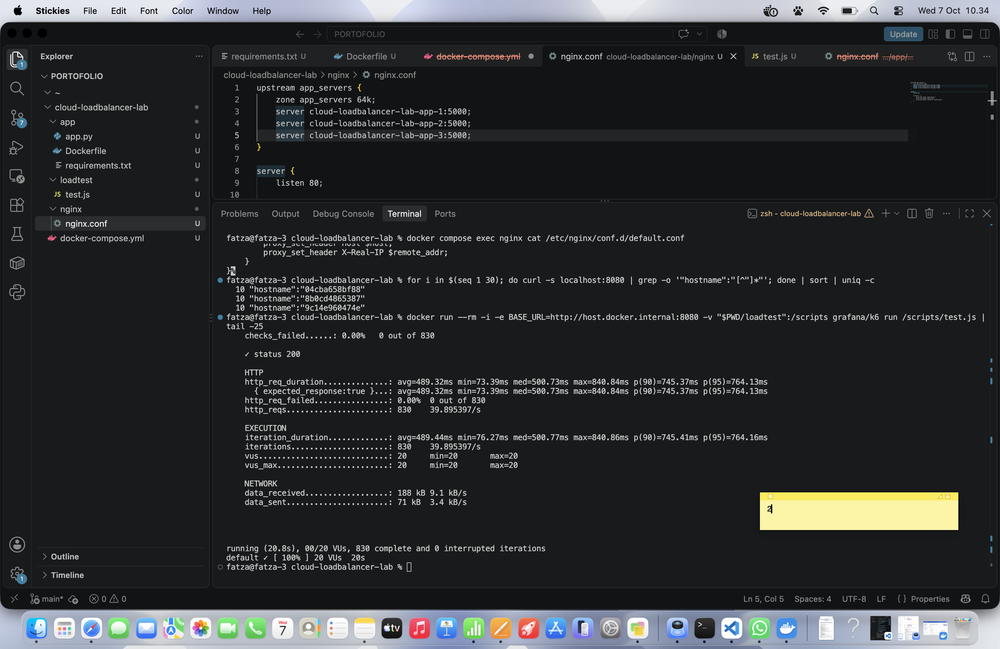

# Cloud Load Balancer Lab

Project kecil untuk mencoba load balancing dan scaling horizontal. Satu aplikasi Flask dijalankan dalam 3 replika container, lalu Nginx membagi request ke ketiganya. Aku bandingkan performanya dengan 1 replika pakai k6.

Dibuat sebagai portofolio untuk pendaftaran magang ICN Lab, bidang Distributed Systems & Cloud Computing.

## Arsitektur

```
                      +--> app-1 (Flask + Gunicorn)
Client --> Nginx -----+--> app-2 (Flask + Gunicorn)
          (:8080)     +--> app-3 (Flask + Gunicorn)
```

- **Nginx** jadi load balancer dengan algoritma round robin.
- **Aplikasi Flask** punya 3 endpoint: `/` (menampilkan hostname container), `/health`, dan `/work` (beban CPU buatan untuk load test).
- **Gunicorn** dijalankan dengan 1 worker per container, jadi tiap container mewakili satu unit kapasitas.
- Semuanya diatur lewat satu `docker-compose.yml`.

## Cara menjalankan

Butuh Docker Desktop.

```bash
docker compose up --build -d
docker compose ps
```

Cek load balancing-nya, hostname harus bergantian:

```bash
for i in $(seq 1 30); do curl -s localhost:8080 | grep -o '"hostname":"[^"]*"'; done | sort | uniq -c
```

Hasil di mesinku, 30 request terbagi rata:

```
  10 "hostname":"04cba658bf88"
  10 "hostname":"8b0cd4865387"
  10 "hostname":"9c14e960474e"
```

## Load test

Pakai k6 lewat Docker, 20 virtual user selama 20 detik ke endpoint `/work`:

```bash
docker run --rm -i -e BASE_URL=http://host.docker.internal:8080 \
  -v "$PWD/loadtest":/scripts grafana/k6 run /scripts/test.js
```

Untuk tes 1 replika, aku beri tanda `#` pada dua baris `server` terakhir di `nginx/nginx.conf`, restart Nginx, lalu jalankan tes yang sama.

### Hasil

| Metrik | 1 replika | 3 replika |
|---|---|---|
| Request per detik | 14.55 | 39.90 |
| Total request (20 detik) | 311 | 830 |
| Latensi rata-rata | 1.33 s | 489 ms |
| Latensi p(95) | 1.40 s | 764 ms |
| Request gagal | 0% | 0% |



## Analisis

Dengan 3 replika, throughput naik sekitar 2,7x dan latensi rata-rata turun sekitar 2,7x. Itu sekitar 91% dari skala ideal 3x. Dengan 1 replika, 20 user mengantre di satu worker, jadi latensi naik jauh di atas waktu proses satu request (~70 ms). Menambah replika membagi antrean itu.

Hasilnya tidak mencapai 3x penuh karena:
- ketiga container berjalan di mesin yang sama dan berbagi CPU,
- Nginx dan jaringan internal Docker menambah overhead kecil.

## Catatan masalah yang kutemui

Awalnya Nginx hanya meneruskan request ke satu replika, padahal `app` sudah ter-resolve ke 3 alamat. Penyebabnya, Nginx berjalan dengan banyak worker process dan masing-masing menyimpan hitungan round robin sendiri. Solusinya menambahkan `zone app_servers 64k;` di blok `upstream` supaya hitungannya dipakai bersama. Setelah itu distribusinya rata.

## Keterbatasan

- Semua berjalan di satu mesin, jadi ini simulasi skala horizontal, bukan multi-node sungguhan.
- Endpoint `/work` adalah beban CPU buatan, hasilnya tidak mewakili aplikasi nyata.
- Daftar replika di `nginx.conf` ditulis manual. Untuk skala lebih besar sebaiknya pakai service discovery atau orkestrator seperti Kubernetes.

## Struktur folder

```
cloud-loadbalancer-lab/
├── app/            # aplikasi Flask + Dockerfile
├── nginx/          # konfigurasi load balancer
├── loadtest/       # skrip k6
├── docs/           # screenshot hasil
└── docker-compose.yml
```